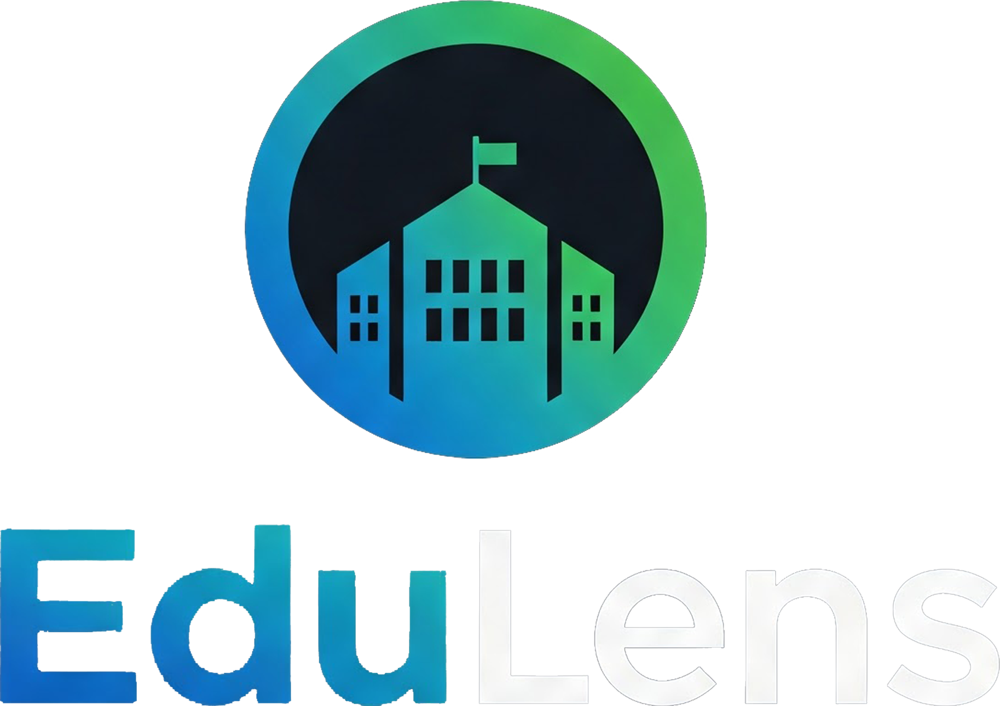

<div align="center"></div> 


<h1 align="center">Tübitak 4006 B Project EduLens Frontend</h1>

---


## ❗Note

- You need to [EduLensBackend](https://github.com/dogukanoklu/edulens-backend)

   ```sh
   # /.env
  NEXT_PUBLIC_API_URL=http://localhost:8000
  NEXT_PUBLIC_WS_URL=wss://dpdfk76v-8001.euw.devtunnels.ms
   ```


## ⚙️ Installation & Set Up

1. Install dependencies

   ```sh
   npm install
   ```

1. Install and use the correct version of Node using [NVM](https://github.com/nvm-sh/nvm)

   ```sh
   nvm install
   ```

1. Start the development server

   ```sh
   npm run dev
   ```

## 🚀 Building and Running for Production

1. Generate a full static production build

   ```sh
   npm run build
   ```

1. Preview the site as it will appear once deployed

   ```sh
   npm run start
   ```

---

## Backend
---
The backend application for EduLens can be found [here](https://github.com/dogukanoklu/edulens-backend).